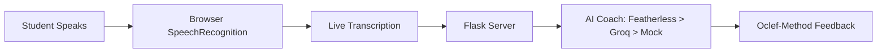

# 🎹 Cadence — AI Music Coach

> Your daily AI piano coach. No sheet music needed. No $60/week lessons. Just describe your practice and get instant, personalized feedback using the Oclef method.

## 🚀 Inspiration

83% of music students quit. Not because they lack talent — because they wait 7 days between feedback sessions. A week is long enough for bad habits to calcify, motivation to drift, and errors to go uncorrected. Meanwhile, private lessons cost $60+/week, putting quality music education out of reach for millions.

Julian Toha, founder of Oclef (the largest online piano school in the US), proved that **daily feedback** — not accumulated practice hours — determines whether a student succeeds. His 91% student success rate vs. the 17% industry average proves the model works. But Oclef still requires human teachers.

**Cadence delivers that same daily feedback loop, powered by AI, accessible to anyone with a phone.**

## 🧠 What It Does

Cadence is a voice-driven AI music coach. Students describe their practice session in their own words — what they worked on, what felt hard, what's stuck. Cadence listens, understands the underlying pedagogical problem, and responds with specific, actionable feedback using the Oclef methodology.

| Feature | Detail |
|---------|--------|
| 🎙️ **Voice Memos** | Just talk about your practice. No sheet music upload, no MIDI, no notation. |
| 🧠 **Oclef Method** | 80/20 rule — isolates the ONE most important thing to fix. Never cognitive overload. |
| 🔥 **Daily Streaks** | Tracks practice consistency. Motivation through momentum. |
| 🎯 **Specific Feedback** | Not "practice more" — "isolate the thumb-under crossover in measure 8, play it 10 times slowly." |

## 🏗️ How We Built It

- **Voice Input:** Browser SpeechRecognition API (free, local, zero latency). No server-side audio processing needed.
- **Backend:** Python Flask with REST API
- **AI Coaching:** 3-tier fallback — Featherless (DeepSeek V3) → Groq (Llama 3.3, free tier) → Mock (13-category keyword-matched coaching database)
- **Frontend:** Vanilla HTML/CSS/JS, mobile-first dark theme, 3-screen SPA

## 💡 Innovation

- **Voice-driven, not note-detection-driven.** Feels natural — like talking to a teacher.
- **Pedagogy-first AI.** The system prompt encodes Julian Toha's exact coaching philosophy: 80/20 method, growth mindset, the Dip vs. Cul-de-sac framework.
- **Zero musical notation required.** Beginners describe what they FEEL, not what they READ.
- **Never-break architecture.** 3-tier AI fallback means the app always responds, even without API keys.

## 🌍 Impact

Music education is broken. 83% dropout rate. $60/week lessons inaccessible to most families. Cadence makes daily, personalized music coaching free and available to anyone with a phone. If adopted: millions of students who would have quit now have a coach in their pocket.

## 🏆 Challenges

- Designing AI prompts that produce genuinely useful coaching (not generic "keep practicing!" responses)
- Keyword-matching the mock database to cover diverse student descriptions
- Building a UI that feels warm and encouraging — not like another tech tool

## 🔮 What's Next

- Real-time audio analysis for direct note feedback
- Sheet music upload with computer vision
- Practice log persistence (JSON file or SQLite)
- iOS/Android native apps

## 🛠️ Tech Stack

`Python` `Flask` `Web Speech API` `Featherless AI` `Groq` `DeepSeek V3` `HTML/CSS/JS`

## 👥 Team

Solo builder. Built in 24 hours for Iris Hacks IV.

---

*"The instrument is the gym. Every practice session builds neural pathways through unseen learning." — Julian Toha*
